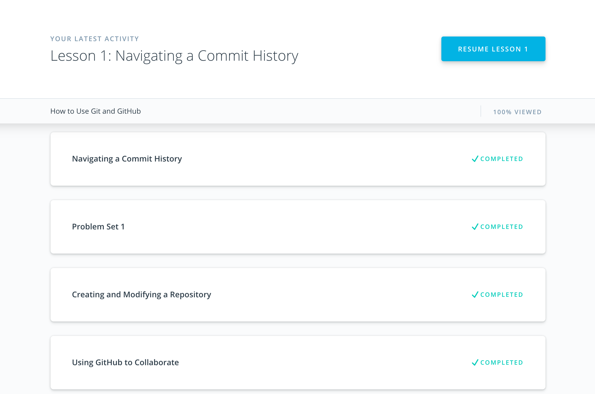
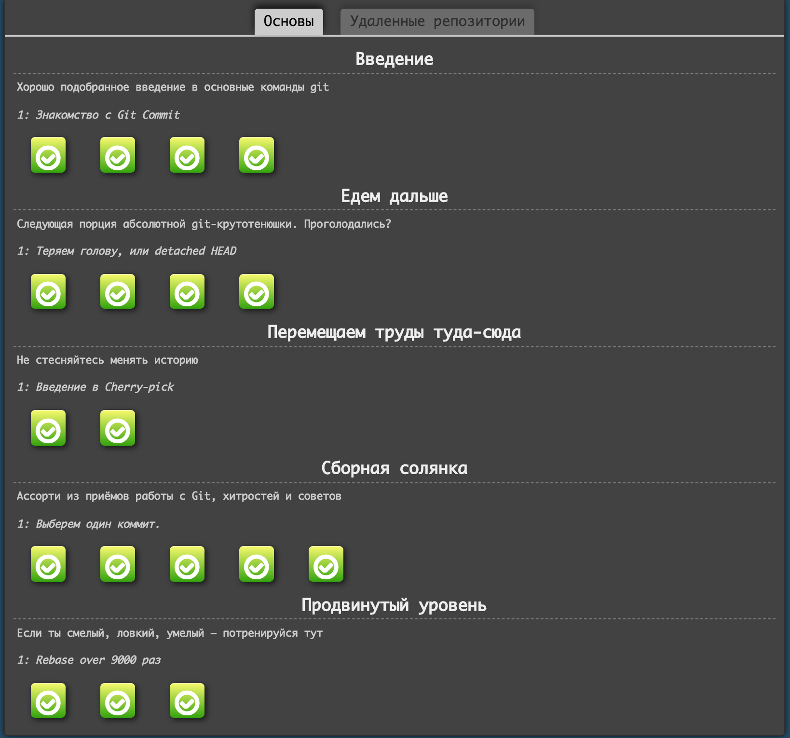
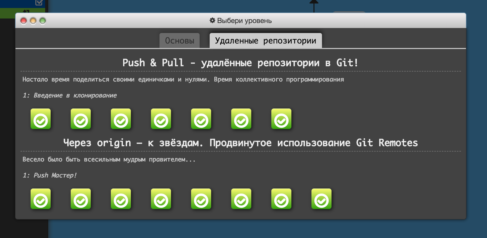
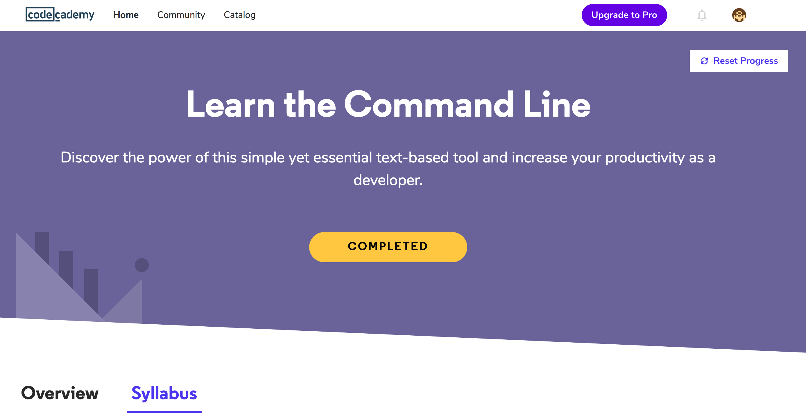
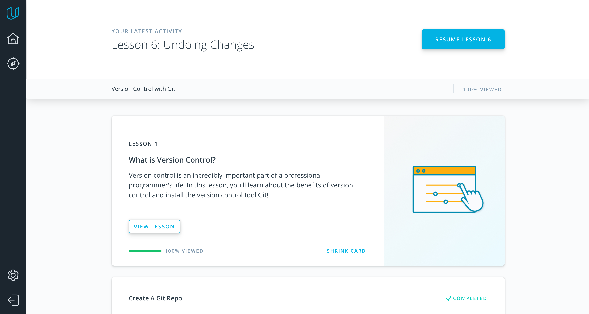
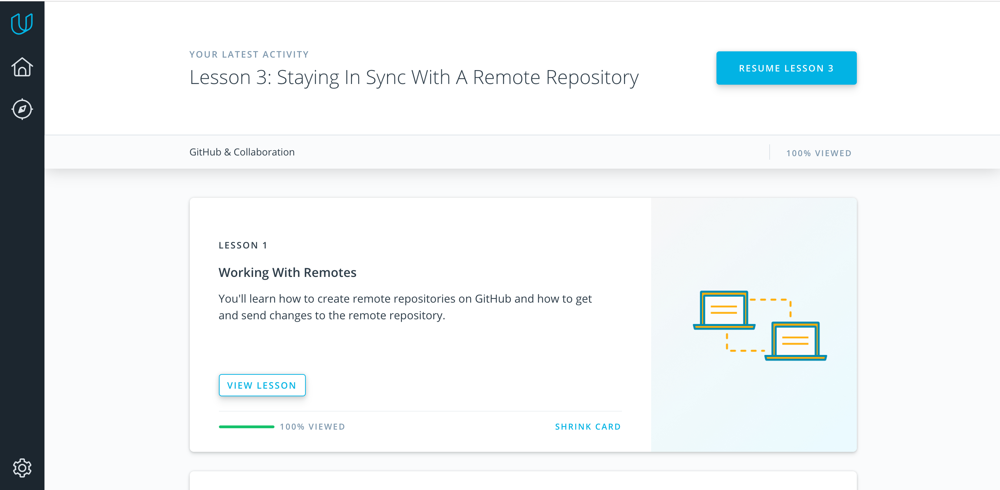
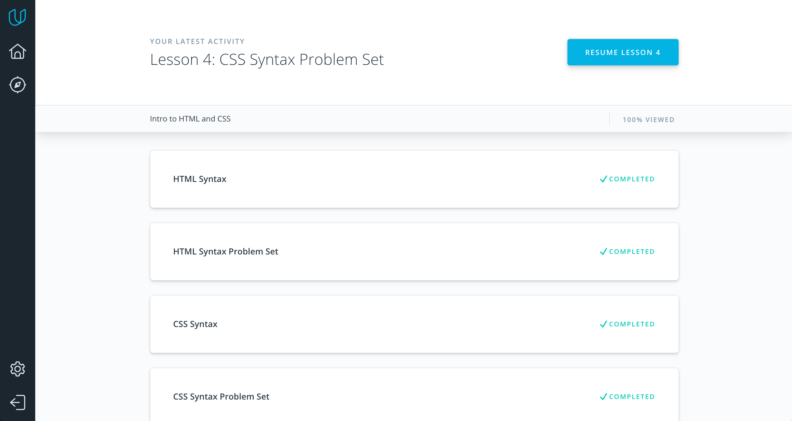
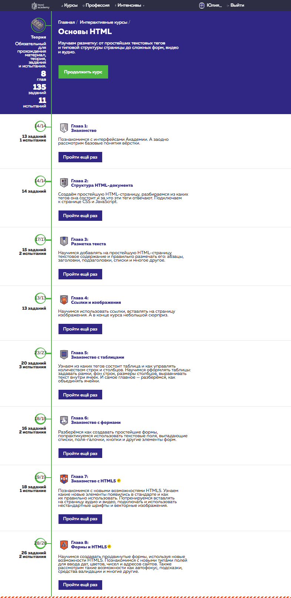
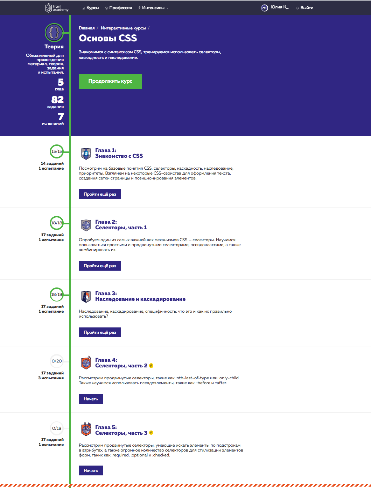

# kottans-frontend

<h2>General Basics</h2>

<h3>Git Basics</h3>

<h4><a href="https://www.udacity.com/course/how-to-use-git-and-github--ud775">Git and GitHub</a></h4>
The Udacity course get me a more comprehensive knowledge of how is git working. In my opinion, it's necessary to know how your working tools work inside.

<h4><a href="try.github.io">try.github.io</a></h4>
The visualization of the git branches allows me to imagine how it's look like 100% clear. Also, I never work with git rebase before. It’s a great way to take commit tree more readable.

## Linux CLI, and HTTP

<h4><a href="https://www.codecademy.com/learn/learn-the-command-line">Learn the Command Line</a></h4>

I have experience with terminal on base level. And this course helped me understand deeply the topic. Now i must think where i can use this cool knowledge to help remove every day routine in work.

 

<h4><a href="https://code.tutsplus.com/tutorials/http-the-protocol-every-web-developer-must-know-part-1--net-31177">HTTP: The Protocol Every Web Developer Must Know - Part 1</a></h4>
<h4><a href="https://code.tutsplus.com/tutorials/http-the-protocol-every-web-developer-must-know-part-2--net-31155">HTTP: The Protocol Every Web Developer Must Know - Part 2</a></h4>

I already have some knowledge and expirience about HTTP.

## Git Collaboration

<h4><a href="https://classroom.udacity.com/courses/ud123/">What is Version Control</a></h4>

It tells in detail why you need a git, where you can use it in real life. Very cool! It’s a pity that I didn’t see this course at the very beginning of my acquaintance with git, he scared me like any newcomer. Nothing new for me.

<h4><a href="https://classroom.udacity.com/courses/ud456">GitHub & Collaboration</a></h4>

I didn't learn anything new for myself, I use all this in my work.

<h2>Front-End Basics</h2>

## Intro to HTML and CSS

Nothing new for me. On courses HTML academy I first learned HTML/CSS. It's perfect for beginners.

